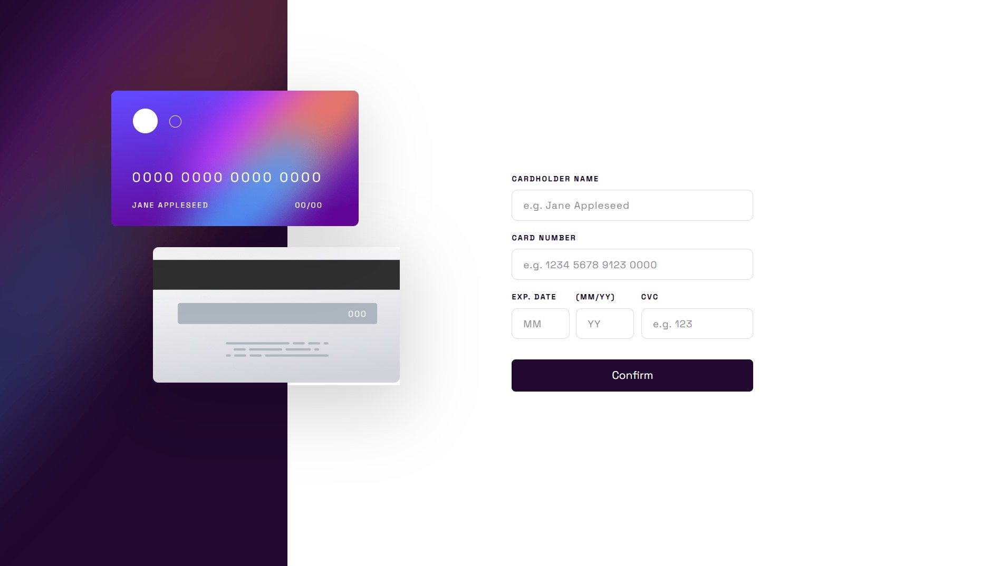

# Frontend Mentor - Interactive card details form solution

This is a solution to the [Interactive card details form challenge on Frontend Mentor](https://www.frontendmentor.io/challenges/interactive-card-details-form-XpS8cKZDWw). Frontend Mentor challenges help you improve your coding skills by building realistic projects.

## Table of contents

- [Overview](#overview)
  - [The challenge](#the-challenge)
  - [Screenshot](#screenshot)
  - [Links](#links)
- [My process](#my-process)
  - [Built with](#built-with)
  - [What I learned](#what-i-learned)
  - [Continued development](#continued-development)
  - [Useful resources](#useful-resources)
- [Author](#author)

## Overview

### The challenge

Users should be able to:

- Fill in the form and see the card details update in real-time
- Receive error messages when the form is submitted if:
  - Any input field is empty
  - The card number, expiry date, or CVC fields are in the wrong format
- View the optimal layout depending on their device's screen size
- See hover, active, and focus states for interactive elements on the page

### Screenshot



### Links

- Solution URL: (https://www.frontendmentor.io/solutions/interactive-card-detail-solution-js3E-RwAJT)
- Live Site URL: (https://cheerful-druid-7f8fb1.netlify.app/)

## My process

### Built with

- Semantic HTML5 markup
- Flexbox
- CSS Grid
- Mobile-first workflow

### What I learned

After submitting my solution I realized that the windows
task bar when is not hidden it will have an effect on your screen
real estate your layout solution will be far more off from the design,
so next time I will make sure that it is hidden and also
that the chrome window is in full size view.

```html
<label for="">,<input type="" placeholders="" maxlength="" /></label>
```

To name an input field for a user you can use the label element
and for the actual input field use the input element and to
limit the number of characters the user can input, you use the
maxlength. To add an example of what the user should input and
in which format you use the placeholders.

```css
.background-image {
  background-url('someurl.here');
  background-size: cover;
  background-repeat: no-repeat;
}
::-webkit-input-placeholder ;
```

You can add images on your page with the css property background-url
and to make sure the image does not repeat itself we use the background-repeat
and set it to no repeat.
To make sure that the image strectes from left to right of the viewport width
you can use background-size and set it to cover.

```js
inputValue.match(/\d+/g);
/^\d+$.test(inputValue);
```

I learned about the use of regular expression, and used it to check if the value of an input contained any numbers, I also used to it to check if the value of an input contained any letters

### Continued development

I want to go back to my Javascript fundamentals, this project made me realize that I do not have my fundamentals intact. I mostly struggled with the logic of how to properly validated a
form and test for many cases a user might present when filling
out the form.

### Useful resources

- [Resource 1](https://www.codegrepper.com) - This helped me for finding the regex of matching any number from a string. And it also helped me with finding any letter from a number.

## Author

- Frontend Mentor - [@Mkhululi97](https://www.frontendmentor.io/profile/Mkhululi97)
